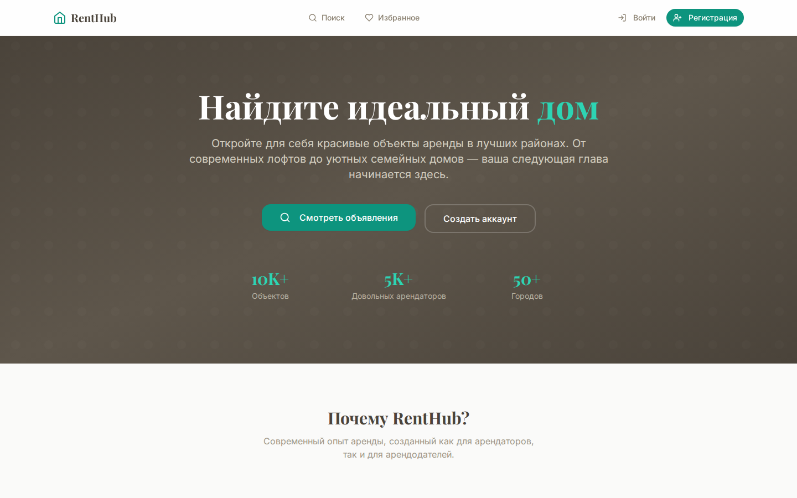
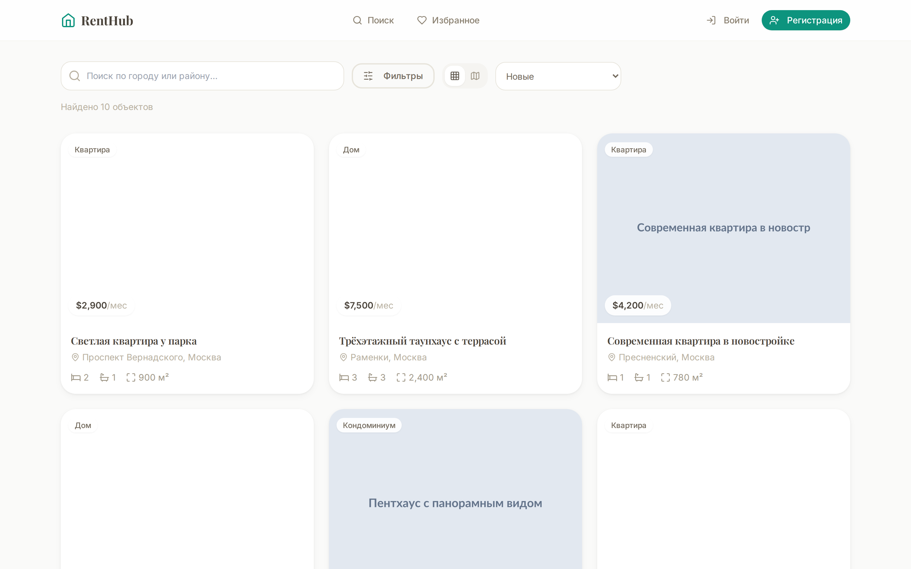
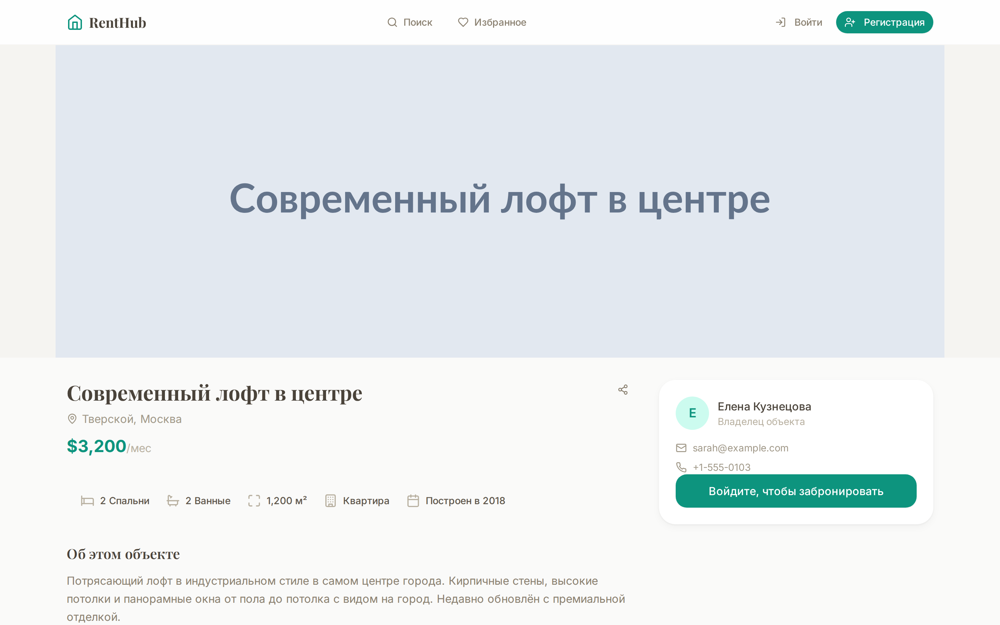
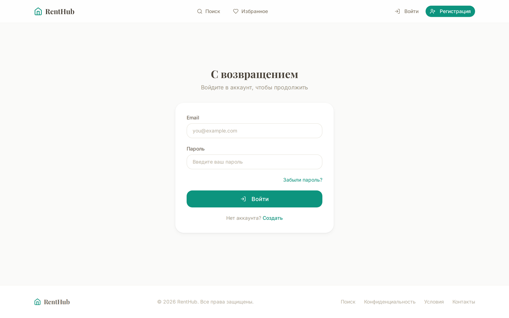
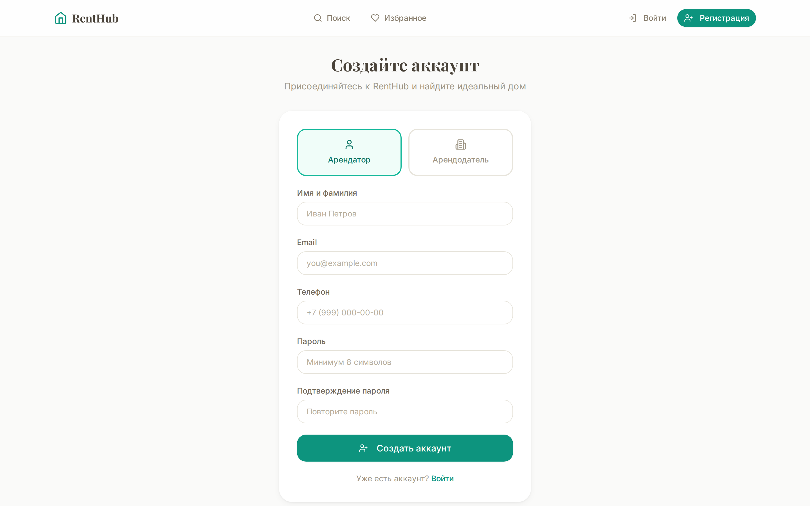
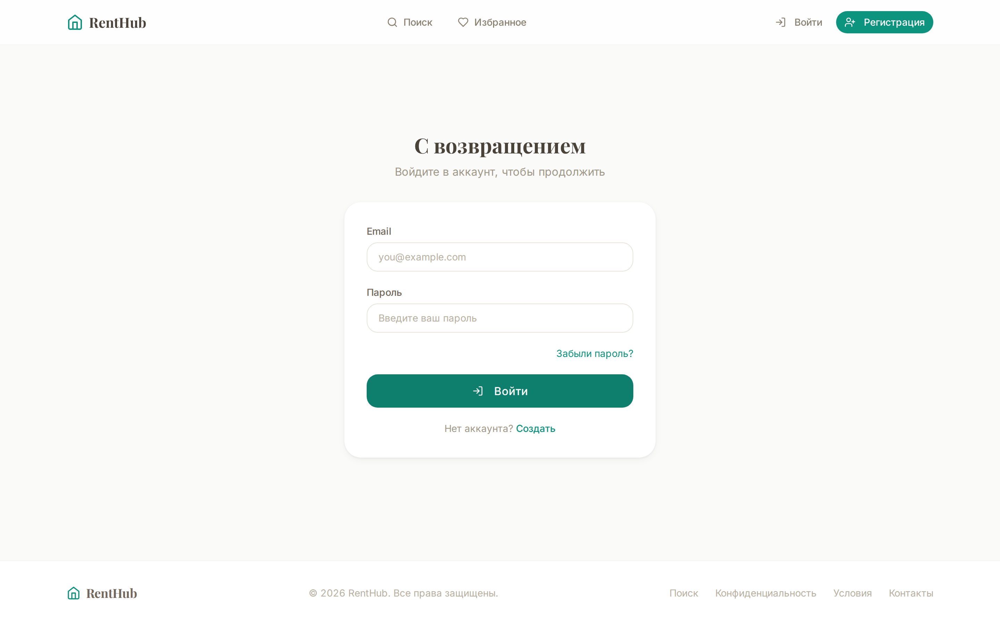

<h1 align="center">
  <br>
  
  <br>
  Ren Hub — Платформа для аренды жилья
  <br>
</h1>

<p align="center">
  <strong>Полнофункциональная платформа для аренды недвижимости</strong><br>
  Веб-приложение на React + мобильное Android-приложение
</p>

<p align="center">
  
</p>

---

## ✨ Возможности

- 🔍 **Поиск и фильтрация** — поиск недвижимости по типу, цене, району и удобствам
- 🏠 **Детальные страницы объектов** — галерея изображений, карта, описание, удобства, арендодатель
- ❤️ **Избранное и сравнение** — сохраняйте варианты и сравнивайте их рядом
- 📅 **Бронирование** — запрос на бронирование, подтверждение/отклонение арендодателем
- 👤 **Два типа аккаунтов** — панели арендатора и арендодателя
- 🔐 **JWT-аутентификация** — регистрация, вход, подтверждение email, сброс пароля
- 📱 **Android-приложение** — нативное приложение с WebView для мобильного доступа
- 🌐 **Мультиязычность** — поддержка русского и английского языков
- 📊 **Панели управления** — статистика и управление для обеих ролей

---

## 🖼️ Скриншоты

<details open>
<summary><strong>📱 Основные страницы</strong></summary>
<br>

### 🏠 Главная страница
Поисковая строка, популярные предложения, категории недвижимости

<p align="center">
  
</p>

### 🔍 Каталог объявлений
Сетка объектов с фильтрацией по цене, типу и району

<p align="center">
  
</p>

### 🏡 Карточка объекта
Детальная информация, галерея, карта, удобства и контакты арендодателя

<p align="center">
  
</p>

### 🔑 Вход
Форма авторизации с валидацией и ссылкой на восстановление пароля

<p align="center">
  
</p>

### 📝 Регистрация
Создание аккаунта с выбором роли (арендатор или арендодатель)

<p align="center">
  
</p>

</details>

<details>
<summary><strong>👤 Панель арендатора</strong></summary>
<br>

### 📊 Дашборд
Обзор сохранённых объектов, активных бронирований и рекомендаций

<p align="center">
  
</p>

### ❤️ Избранное
Сохранённые варианты с быстрым доступом к сравнению

<p align="center">
  
</p>

### 📅 Мои бронирования
История и статусы всех запросов на бронирование

<p align="center">
  
</p>

</details>

<details>
<summary><strong>🏢 Панель арендодателя</strong></summary>
<br>

### 📊 Дашборд арендодателя
Управление объявлениями, просмотры и статистика

<p align="center">
  
</p>

### 📋 Запросы на бронирование
Подтверждение и отклонение запросов арендаторов

<p align="center">
  
</p>

</details>

---

## 🛠️ Технологический стек

| Слой | Технологии |
|------|-------------|
| **Frontend** | React 18, TypeScript, Tailwind CSS, React Router 6 |
| **State** | TanStack Query 5, Zustand |
| **UI** | Radix UI (Dialog, Select, Tabs, Dropdown, Checkbox) |
| **HTTP** | Axios |
| **Backend** | Node.js, Express, TypeScript |
| **ORM** | Prisma |
| **Auth** | JWT (access + refresh токены), bcryptjs |
| **Валидация** | Zod |
| **Загрузка файлов** | Multer |
| **База данных** | SQLite (dev), PostgreSQL (production-ready) |
| **Мобильное** | Android (Kotlin + WebView) |
| **Тестирование** | Playwright (E2E) |

---

## 🚀 Быстрый старт

### Предварительные требования

- **Node.js** ≥ 18
- **npm** ≥ 9
- **Android Studio** (для сборки Android-приложения)

### Установка и запуск

```bash
# 1. Клонировать репозиторий
git clone https://github.com/yourusername/rental-app.git
cd rental-app

# 2. Установить зависимости
npm install

# 3. Применить миграции базы данных
npm run db:migrate

# 4. Заполнить тестовыми данными
npm run db:seed

# 5. Запустить сервер и клиент
npm run dev
```

После запуска:
- **Веб-приложение**: http://localhost:5173
- **API сервер**: http://localhost:8080

### Тестовые аккаунты

| Роль | Email | Пароль |
|------|-------|--------|
| Арендатор | `anna@example.com` | `password123` |
| Арендодатель | `sarah@example.com` | `password123` |

---

## 📱 Android-приложение

Приложение использует WebView для отображения веб-версии с нативными улучшениями:

```bash
cd android
./gradlew assembleDebug
```

Подробнее в [android/README.md](android/README.md)

---

## 📁 Структура проекта

```
rental-app/
├── client/          # React frontend (Vite)
│   └── src/
│       ├── components/  # UI компоненты
│       ├── pages/       # Страницы
│       ├── hooks/       # React-хуки
│       ├── store/       # Zustand-хранилище
│       └── lib/         # Утилиты, API-клиент
├── server/          # Express backend
│   └── src/
│       ├── routes/      # API маршруты
│       ├── services/    # Бизнес-логика
│       ├── middleware/  # Auth, валидация
│       └── db/          # Prisma-схема и сиды
├── shared/          # Общие типы и константы
└── android/         # Android-приложение (Kotlin)
```

---

## 📄 Лицензия

MIT
